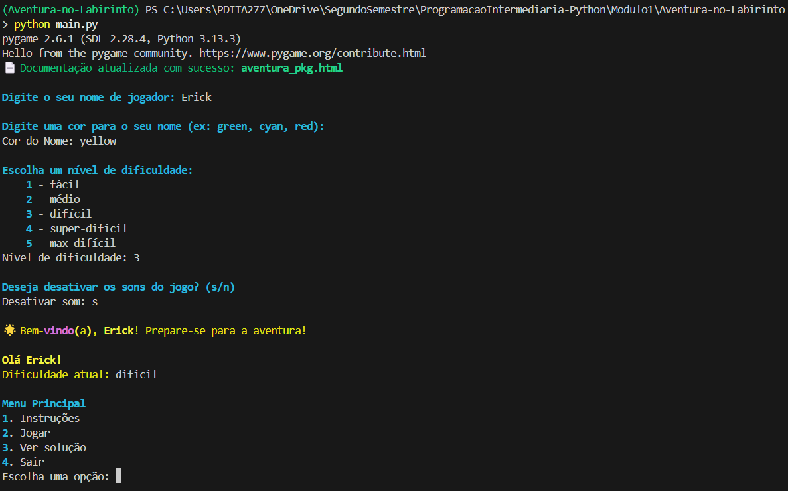
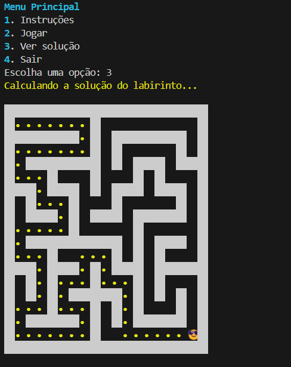
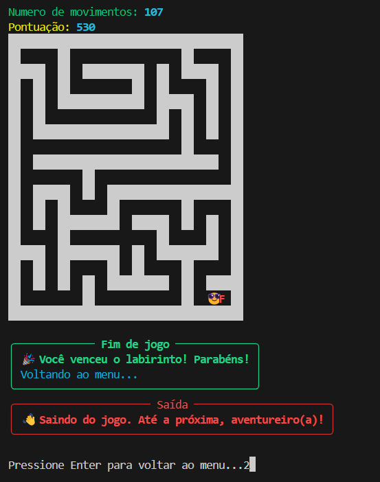
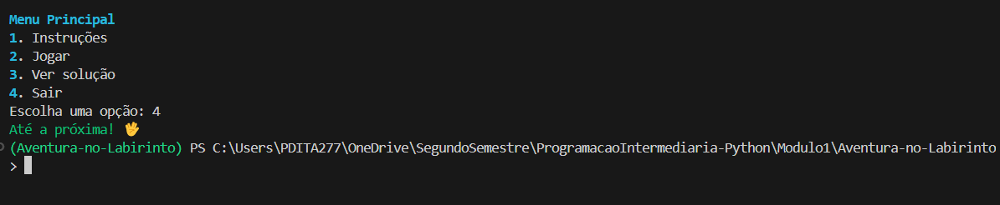

# 🧹 Aventura no Labirinto

Um jogo de terminal em Python onde você navega por labirintos usando o teclado. Com suporte a sons, cores, níveis de dificuldade e animações visuais no terminal.

---

## 📦 Requisitos

- Python 3.10+
- Rich
- Pynput
- Pygame

Instale com:

```bash
pip install -r requerements.txt
```

---

## ▶️ Como jogar

Execute o jogo com argumentos diretamente:

```bash
python main.py --name SeuNome --color green --dificuldade medio --som
```

Ou apenas rode `main.py` e use o menu interativo:

```bash
python main.py
```

---

## 🎮 Menu Principal

|                            |                            |
|----------------------------|----------------------------|
|  |  |

---

## 📜 Instruções

- Use as setas do teclado para mover o personagem.
- Encontre a saída do labirinto para vencer.
- Vários níveis de dificuldade disponíveis.
- Sons ativados para passos, vitória e saída.

|                                    |                                     |
|------------------------------------|-------------------------------------|
|  |  |

---

## 🧠 Resolução Automática

O jogo permite visualizar a solução recursiva do labirinto:

|                               |                               |
|-------------------------------|-------------------------------|
|  |  |

---

## 🔊 Sons

- Passos
- Vitória
- Saída do jogo

Todos os sons podem ser ativados com `--som` ou desativados com `--sem-som`.


---

## 🧱 Exemplo de Labirinto

|                                |                                 |
|--------------------------------|---------------------------------|
|  |  |  |

---

## 🧾 Versão com argparse

A versão principal do jogo usa argparse para permitir configurações personalizadas diretamente na linha de comando:

```bash
python main.py --name Alice --color cyan --dificuldade dificil --som
```

Parâmetros disponíveis:
- `--name`: Nome do jogador (ex: Alice)
- `--color`: Cor do nome (ex: green, red, cyan)
- `--dificuldade`: Nível de dificuldade (facil, medio, dificil, super-dificil, max-dificil)
- `--som`: Ativa os sons do jogo
- `--sem-som`: Desativa os sons do jogo

---

## 📸 Prints do Jogo

Você pode visualizar capturas de tela do jogo abaixo:

| Tela                      | Imagem                          |
|--------------------------|---------------------------------|
| Menu Principal           |         |
| Instruções               |  |
| Solução do Labirinto     |   |
| Exemplo de Labirinto     |  |

---

## 📁 Estrutura de Pastas

```
Aventura-no-Labirinto/
├── aventura_pkg/
│   ├── __init__.py
│   ├── jogador.py
│   ├── labirinto.py
│   └── utils.py
├── sons/
│   ├── passo.mp3
│   ├── vitoria.mp3
│   └── saida.mp3
├── prints/
│   ├── menu.png
│   ├── instrucoes.png
│   ├── solucao.png
│   ├── labirinto.png
│   └── som.png
├── main.py
├── requirements.txt
└── README.md
```

---

## 🛠️ Em desenvolvimento

- [ ] Novos tipos de labirinto
- [ ] Salvamento de progresso
- [ ] Ranking de pontuação

---

## 🧑‍💻 Autor

Feito por [Erick Oliveira](https://github.com/seuusuario) com dedicação, para fins educacionais.

"Estou satisfeito por conseguir finalizar esse projeto, espero que seja divertido e emocionante para todos os usuários."

